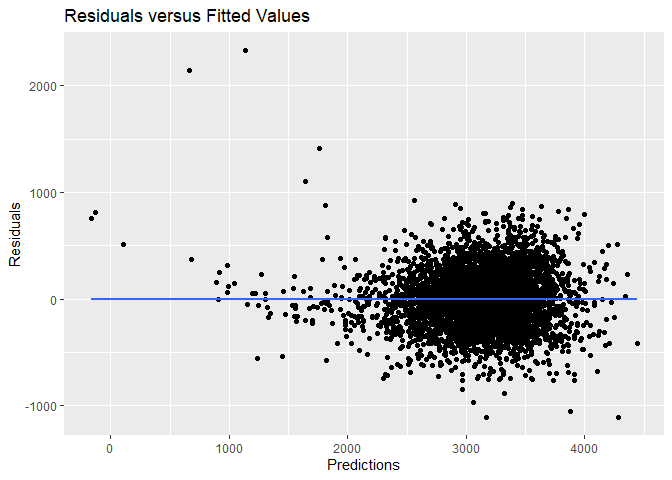
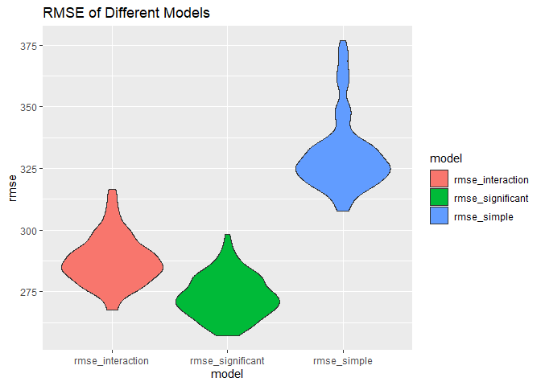

p8105_hw6_yz4719
================
Yuxin Zhang
2023-12-01

``` r
library(tidyverse)
```

    ## ── Attaching core tidyverse packages ──────────────────────── tidyverse 2.0.0 ──
    ## ✔ dplyr     1.1.3     ✔ readr     2.1.4
    ## ✔ forcats   1.0.0     ✔ stringr   1.5.0
    ## ✔ ggplot2   3.4.3     ✔ tibble    3.2.1
    ## ✔ lubridate 1.9.2     ✔ tidyr     1.3.0
    ## ✔ purrr     1.0.2     
    ## ── Conflicts ────────────────────────────────────────── tidyverse_conflicts() ──
    ## ✖ dplyr::filter() masks stats::filter()
    ## ✖ dplyr::lag()    masks stats::lag()
    ## ℹ Use the conflicted package (<http://conflicted.r-lib.org/>) to force all conflicts to become errors

``` r
library(purrr)
library(ggplot2)
library(modelr)
library(boot)
library(broom)
```

    ## 
    ## 载入程辑包：'broom'
    ## 
    ## The following object is masked from 'package:modelr':
    ## 
    ##     bootstrap

``` r
library(janitor)
```

    ## 
    ## 载入程辑包：'janitor'
    ## 
    ## The following objects are masked from 'package:stats':
    ## 
    ##     chisq.test, fisher.test

``` r
library(MASS)
```

    ## 
    ## 载入程辑包：'MASS'
    ## 
    ## The following object is masked from 'package:dplyr':
    ## 
    ##     select

``` r
library(dplyr)
```

### Problem 1

In the data cleaning code below we create a `city_state` variable,
change `victim_age` to numeric, modifiy victim_race to have categories
white and non-white, with white as the reference category, and create a
`resolution` variable indicating whether the homicide is solved. Lastly,
we filtered out the following cities: Tulsa, AL; Dallas, TX; Phoenix,
AZ; and Kansas City, MO; and we retained only the variables
`city_state`, `resolution`, `victim_age`, `victim_sex`, and
`victim_race`.

``` r
homicide_df = 
  read_csv("data/homicide-data.csv", na = c("", "NA", "Unknown")) |> 
  mutate(
    city_state = str_c(city, state, sep = ", "),
    victim_age = as.numeric(victim_age),
    resolution = case_when(
      disposition == "Closed without arrest" ~ 0,
      disposition == "Open/No arrest"        ~ 0,
      disposition == "Closed by arrest"      ~ 1)
  ) |> 
  filter(victim_race %in% c("White", "Black")) |> 
  filter(!(city_state %in% c("Tulsa, AL", "Dallas, TX", "Phoenix, AZ", "Kansas City, MO"))) |> 
  dplyr::select(city_state, resolution, victim_age, victim_sex, victim_race)
```

    ## Rows: 52179 Columns: 12
    ## ── Column specification ────────────────────────────────────────────────────────
    ## Delimiter: ","
    ## chr (8): uid, victim_last, victim_first, victim_race, victim_sex, city, stat...
    ## dbl (4): reported_date, victim_age, lat, lon
    ## 
    ## ℹ Use `spec()` to retrieve the full column specification for this data.
    ## ℹ Specify the column types or set `show_col_types = FALSE` to quiet this message.

Next we fit a logistic regression model using only data from Baltimore,
MD. We model `resolved` as the outcome and `victim_age`, `victim_sex`,
and `victim_race` as predictors. We save the output as `baltimore_glm`
so that we can apply `broom::tidy` to this object and obtain the
estimate and confidence interval of the adjusted odds ratio for solving
homicides comparing non-white victims to white victims.

``` r
baltimore_glm = 
  filter(homicide_df, city_state == "Baltimore, MD") |> 
  glm(resolution ~ victim_age + victim_sex + victim_race, family = binomial(), data = _)

baltimore_glm |> 
  broom::tidy() |> 
  mutate(
    OR = exp(estimate), 
    OR_CI_upper = exp(estimate + 1.96 * std.error),
    OR_CI_lower = exp(estimate - 1.96 * std.error)) |> 
  filter(term == "victim_sexMale") |> 
  dplyr::select(OR, OR_CI_lower, OR_CI_upper) |>
  knitr::kable(digits = 3)
```

|    OR | OR_CI_lower | OR_CI_upper |
|------:|------------:|------------:|
| 0.426 |       0.325 |       0.558 |

Below, by incorporating `nest()`, `map()`, and `unnest()` into the
preceding Baltimore-specific code, we fit a model for each of the
cities, and extract the adjusted odds ratio (and CI) for solving
homicides comparing non-white victims to white victims. We show the
first 5 rows of the resulting dataframe of model results.

``` r
model_results = 
  homicide_df |> 
  nest(data = -city_state) |> 
  mutate(
    models = map(data, \(df) glm(resolution ~ victim_age + victim_sex + victim_race, 
                             family = binomial(), data = df)),
    tidy_models = map(models, broom::tidy)) |> 
  dplyr::select(-models, -data) |> 
  unnest(cols = tidy_models) |> 
  mutate(
    OR = exp(estimate), 
    OR_CI_upper = exp(estimate + 1.96 * std.error),
    OR_CI_lower = exp(estimate - 1.96 * std.error)) |> 
  filter(term == "victim_sexMale") |> 
  dplyr::select(city_state, OR, OR_CI_lower, OR_CI_upper)

model_results |>
  slice(1:5) |> 
  knitr::kable(digits = 3)
```

| city_state      |    OR | OR_CI_lower | OR_CI_upper |
|:----------------|------:|------------:|------------:|
| Albuquerque, NM | 1.767 |       0.831 |       3.761 |
| Atlanta, GA     | 1.000 |       0.684 |       1.463 |
| Baltimore, MD   | 0.426 |       0.325 |       0.558 |
| Baton Rouge, LA | 0.381 |       0.209 |       0.695 |
| Birmingham, AL  | 0.870 |       0.574 |       1.318 |

Below we generate a plot of the estimated ORs and CIs for each city,
ordered by magnitude of the OR from smallest to largest. From this plot
we see that most cities have odds ratios that are smaller than 1,
suggesting that crimes with male victims have smaller odds of resolution
compared to crimes with female victims after adjusting for victim age
and race. This disparity is strongest in New yrok. In roughly half of
these cities, confidence intervals are narrow and do not contain 1,
suggesting a significant difference in resolution rates by sex after
adjustment for victim age and race.

``` r
model_results |> 
  mutate(city_state = fct_reorder(city_state, OR)) |> 
  ggplot(aes(x = city_state, y = OR)) + 
  geom_point() + 
  geom_errorbar(aes(ymin = OR_CI_lower, ymax = OR_CI_upper)) + 
  theme(axis.text.x = element_text(angle = 90, hjust = 1))
```

<!-- -->

### Problem 2

``` r
weather_df = 
  rnoaa::meteo_pull_monitors(
    c("USW00094728"),
    var = c("PRCP", "TMIN", "TMAX"), 
    date_min = "2022-01-01",
    date_max = "2022-12-31") |>
  mutate(
    name = recode(id, USW00094728 = "CentralPark_NY"),
    tmin = tmin / 10,
    tmax = tmax / 10) |>
  dplyr::select(name, id, everything())
```

    ## using cached file: C:\Users\zyx\AppData\Local/R/cache/R/rnoaa/noaa_ghcnd/USW00094728.dly

    ## date created (size, mb): 2023-12-02 17:36:31.728716 (8.561)

    ## file min/max dates: 1869-01-01 / 2023-11-30

The boostrap is helpful when you’d like to perform inference for a
parameter/ value/ summary that doesn’t have an easy-to-write-down
distribution in the usual repeated sampling framework. We’ll focus on a
simple linear regression with `tmax` as the response with `tmin` and
`prcp` as the predictors, and are interested in the distribution of two
quantities estimated from these data:

- $\hat{r}^2$
- $\log(\hat{\beta}_1 \times \hat{\beta}_2)$

Use 5000 bootstrap samples and, for each bootstrap sample, produce
estimates of these two quantities.

- Plot the distribution of your estimates, and describe these in words.
- Using the 5000 bootstrap estimates, identify the 2.5% and 97.5%
  quantiles to provide a 95% confidence interval for $\hat{r}^2$ and
  $\log(\hat{\beta}_0 \times \hat{\beta}_1)$.

Note: broom::glance() is helpful for extracting $\hat{r}^2$ from a
fitted regression, and `broom::tidy()` (with some additional wrangling)
should help in computing $\log(\hat{\beta}_1 \times \hat{\beta}_2)$.

``` r
# Define the number of bootstrap samples
n = 5000

# Function to generate a bootstrap sample
bootstrap_sample = function(df) {
  sample_frac(df, replace = TRUE)
}

# Generate bootstrap samples
boot_samples = map_dfr(1:n, ~{
  df_sample = bootstrap_sample(weather_df)
  model = lm(tmax ~ tmin + prcp, data = df_sample)
  tidy_model = tidy(model)
  glance_model = glance(model)

  # Calculate log(beta1 * beta2), handling NA values
  beta1 = tidy_model$estimate[tidy_model$term == "tmin"]
  beta2 = tidy_model$estimate[tidy_model$term == "prcp"]
  log_beta_product = ifelse(beta1 * beta2 > 0, log(beta1 * beta2), NA_real_)

  # Return a dataframe with the necessary statistics
  tibble(
    r_squared = glance_model$r.squared,
    log_beta_product = log_beta_product
  )
})

# Drop NA values
bootstrap_results_filtered = boot_samples |> filter(!is.na(log_beta_product))

# Plotting the distributions using density plots
ggplot(bootstrap_results_filtered, aes(x = r_squared)) +
  geom_density() +
  labs(title = "Density Distribution of R-squared Estimates", x = "R-squared", y = "Density")
```

<!-- -->

``` r
ggplot(bootstrap_results_filtered, aes(x = log_beta_product)) +
  geom_density() +
  labs(title = "Density Distribution of log(beta1 * beta2) Estimates", x = "log(beta1 * beta2)", y = "Density")
```

<!-- -->

``` r
# Calculating 95% confidence intervals
ci_95 = bootstrap_results_filtered |>
  summarize(
    rsq_lower_ci = quantile(r_squared, 0.025, na.rm = TRUE),
    rsq_upper_ci = quantile(r_squared, 0.975, na.rm = TRUE),
    log_beta_lower_ci = quantile(log_beta_product, 0.025, na.rm = TRUE),
    log_beta_upper_ci = quantile(log_beta_product, 0.975, na.rm = TRUE)
  )

# Displaying confidence intervals
print(ci_95)
```

    ## # A tibble: 1 × 4
    ##   rsq_lower_ci rsq_upper_ci log_beta_lower_ci log_beta_upper_ci
    ##          <dbl>        <dbl>             <dbl>             <dbl>
    ## 1        0.882        0.927             -8.89             -4.57

- The first plot displays the density of R-squared estimates from
  bootstrap samples, peaking around 0.92, indicating a strong and
  consistent relationship in the linear regression models.

- The second plot shows the density of the log-transformed product of
  two regression coefficients (beta1 and beta2), with a peak near -6 and
  a long tail to the left, suggesting variability with some extreme
  values in the bootstrap samples.

### Problem 3

``` r
birth_weight <- read_csv("data/birthweight.csv") |>
  clean_names() |> 
  mutate(
    babysex = case_match(
      babysex,
      1 ~ 'male',
      2 ~ 'female'),
    frace = case_match(
      frace, 
      1 ~ "White", 
      2 ~ "Black", 
      3 ~ "Asian", 
      4 ~ "Puerto Rican", 
      8 ~ "Other", 
      9 ~ "Unknown"),
    malform = case_match(
      malform, 
      0 ~ 'absent',
      1 ~ 'present'),
    mrace = case_match(
      mrace, 
      1 ~ "White", 
      2 ~ "Black", 
      3 ~ "Asian", 
      4 ~ "Puerto Rican", 
      8 ~ "Other")
  )
```

    ## Rows: 4342 Columns: 20
    ## ── Column specification ────────────────────────────────────────────────────────
    ## Delimiter: ","
    ## dbl (20): babysex, bhead, blength, bwt, delwt, fincome, frace, gaweeks, malf...
    ## 
    ## ℹ Use `spec()` to retrieve the full column specification for this data.
    ## ℹ Specify the column types or set `show_col_types = FALSE` to quiet this message.

``` r
# Check for missing values
sum(is.na(birth_weight))
```

    ## [1] 0

``` r
full_model <- lm(bwt ~ ., data = birth_weight) 
summary(full_model)
```

    ## 
    ## Call:
    ## lm(formula = bwt ~ ., data = birth_weight)
    ## 
    ## Residuals:
    ##      Min       1Q   Median       3Q      Max 
    ## -1097.68  -184.86    -3.33   173.09  2344.15 
    ## 
    ## Coefficients: (3 not defined because of singularities)
    ##                     Estimate Std. Error t value Pr(>|t|)    
    ## (Intercept)       -6306.8346   659.2640  -9.566  < 2e-16 ***
    ## babysexmale         -28.7073     8.4652  -3.391 0.000702 ***
    ## bhead               130.7781     3.4523  37.881  < 2e-16 ***
    ## blength              74.9536     2.0217  37.075  < 2e-16 ***
    ## delwt                 4.1007     0.3948  10.386  < 2e-16 ***
    ## fincome               0.2898     0.1795   1.614 0.106551    
    ## fraceBlack           -6.9048    78.8349  -0.088 0.930210    
    ## fraceOther          -16.9392    97.5932  -0.174 0.862212    
    ## fracePuerto Rican   -68.2323    78.4692  -0.870 0.384599    
    ## fraceWhite          -21.2361    69.2960  -0.306 0.759273    
    ## gaweeks              11.5494     1.4654   7.882 4.06e-15 ***
    ## malformpresent        9.7650    70.6259   0.138 0.890039    
    ## menarche             -3.5508     2.8951  -1.226 0.220083    
    ## mheight               9.7874    10.3116   0.949 0.342588    
    ## momage                0.7593     1.2221   0.621 0.534418    
    ## mraceBlack          -60.0488    80.9532  -0.742 0.458266    
    ## mracePuerto Rican    34.9079    80.9481   0.431 0.666317    
    ## mraceWhite           91.3866    71.9190   1.271 0.203908    
    ## parity               95.5411    40.4793   2.360 0.018307 *  
    ## pnumlbw                   NA         NA      NA       NA    
    ## pnumsga                   NA         NA      NA       NA    
    ## ppbmi                 4.3538    14.8913   0.292 0.770017    
    ## ppwt                 -3.4716     2.6121  -1.329 0.183913    
    ## smoken               -4.8544     0.5871  -8.269  < 2e-16 ***
    ## wtgain                    NA         NA      NA       NA    
    ## ---
    ## Signif. codes:  0 '***' 0.001 '**' 0.01 '*' 0.05 '.' 0.1 ' ' 1
    ## 
    ## Residual standard error: 272.5 on 4320 degrees of freedom
    ## Multiple R-squared:  0.7183, Adjusted R-squared:  0.717 
    ## F-statistic: 524.6 on 21 and 4320 DF,  p-value: < 2.2e-16

``` r
significant_model <- lm(bwt ~ bhead + blength + delwt + gaweeks + mrace + smoken + parity, data = birth_weight)


significant_model |> broom::tidy() |> knitr::kable()
```

| term              |     estimate |   std.error |   statistic |   p.value |
|:------------------|-------------:|------------:|------------:|----------:|
| (Intercept)       | -5836.820595 | 105.0982068 | -55.5368238 | 0.0000000 |
| bhead             |   129.889005 |   3.4229581 |  37.9464199 | 0.0000000 |
| blength           |    75.737863 |   2.0230943 |  37.4366449 | 0.0000000 |
| delwt             |     2.280598 |   0.1962792 |  11.6191558 | 0.0000000 |
| gaweeks           |    12.619724 |   1.4602448 |   8.6421975 | 0.0000000 |
| mraceBlack        |   -72.575029 |  42.5775234 |  -1.7045385 | 0.0883522 |
| mracePuerto Rican |   -42.621259 |  45.4533618 |  -0.9376921 | 0.3484549 |
| mraceWhite        |    74.686380 |  42.5218838 |   1.7564222 | 0.0790870 |
| smoken            |    -4.840771 |   0.5882370 |  -8.2292875 | 0.0000000 |
| parity            |   102.330068 |  40.5669046 |   2.5225013 | 0.0116879 |

``` r
birth_weight |> 
    add_predictions(significant_model) |> 
    add_residuals(significant_model) |> 
    ggplot(aes(x = pred, y = resid)) +
    geom_point()  + 
    geom_smooth(method = "lm", se = FALSE) + 
    labs(title = "Residuals versus Fitted Values", 
         x = "Predictions", 
         y = "Residuals")
```

    ## `geom_smooth()` using formula = 'y ~ x'

<!-- --> - The
regression model summary indicates that the variables bhead, blength,
delwt, gaweeks, parity, babysexmale, mraceWhite, and smoken are
statistically significant predictors of birth weight.The residuals plot
shows that the residuals scatter around 0 without a clear funnel shape
shows its not obvious heteroscedasticity.

``` r
cv_df <- crossv_mc(birth_weight, 100) |>
  mutate(
    train = map(train, as_tibble),
    test = map(test, as_tibble),
    model_significant = map(train, ~lm(bwt ~ bhead + blength + delwt + gaweeks + mrace + smoken + parity, data = .x)),
    model_simple = map(train, ~lm(bwt ~ blength + gaweeks, data = .x)),
    model_interaction = map(train, ~lm(bwt ~ bhead * blength * babysex, data = .x))
  ) |>
  mutate(
    rmse_significant = map2_dbl(model_significant, test, ~rmse(model = .x, data = .y)),
    rmse_simple = map2_dbl(model_simple, test, ~rmse(model = .x, data = .y)),
    rmse_interaction = map2_dbl(model_interaction, test, ~rmse(model = .x, data = .y))
  )
```

    ## Warning: There were 2 warnings in `mutate()`.
    ## The first warning was:
    ## ℹ In argument: `rmse_significant = map2_dbl(model_significant, test,
    ##   ~rmse(model = .x, data = .y))`.
    ## Caused by warning in `predict.lm()`:
    ## ! prediction from rank-deficient fit; attr(*, "non-estim") has doubtful cases
    ## ℹ Run `dplyr::last_dplyr_warnings()` to see the 1 remaining warning.

``` r
cv_df |>
  pivot_longer(
    cols = c(rmse_significant, rmse_simple, rmse_interaction),
    names_to = "model",
    values_to = "rmse"
  ) |>
  ggplot(aes(x = model, y = rmse, fill = model)) +
  geom_violin() +
  labs(title = "RMSE of Different Models")
```

<!-- -->

- The violin plot displays RMSE comparisons for three models; the
  rmse_significant model outperforms the others with the lowest RMSE as
  more reliable, while the rmse_interaction model shows the highest
  error, indicating poorer prediction.
